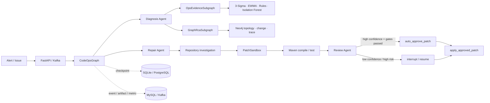

<div align="right">

[English](README-en.md) · [中文](README.md)

</div>

<div align="center">

# Ops AutoAgent Diagnosis

### A LangGraph agent that turns alerts into verified code fixes

[](pyproject.toml)
[](https://langchain-ai.github.io/langgraph/)
[](src/ops_autoagent/api.py)
[](docs/eval-report.md)
[](LICENSE)

**Start with an alert. Gather evidence, find the code, generate a patch, compile and test it, review it independently, then auto-apply it to a managed worktree only when every gate passes.**

</div>

---

## What it does

An order-duplication alert should not end with an LLM saying “this may be an idempotency issue.” This project carries the incident through a verifiable repair loop:

```text
Alert
  → metrics / logs / traces / runbooks
  → anomaly detection + graph-correlated RCA
  → code localization
  → patch generation in PatchSandbox
  → Maven compilation and tests
  → independent risk review
  → automatic apply / human confirmation for uncertain cases
```

The model can propose diagnoses and patches; it cannot write a repository directly. `apply_approved_patch`, guarded by policy, digests, and an audit record, is the only mutation boundary.

## Three agents, clear responsibilities

| Agent | Input and output | Side-effect boundary |
| --- | --- | --- |
| **Diagnosis Agent** | Turns metrics, logs, traces, runbooks, anomaly signals, and Neo4j candidates into a diagnosis and localization constraints. | Read-only |
| **Repair Agent** | Searches code and tests, then proposes the smallest patch and verification plan in PatchSandbox. | PatchSandbox only |
| **Review Agent** | Produces a structured release decision from actual Scope Guard, compilation, test, dry-run, and risk facts. | Read-only |

`CodeOpsGraph` is the parent graph. It owns ordering, retries, checkpoints, SSE events, and write authority. Domain subgraphs handle evidence, graph RCA, repository investigation, repair, verification, and independent review; none owns global write permission.



## A real end-to-end case

**Incident: duplicate writes caused by concurrent order retries.** Observability input is a sanitized `TEST_SIMULATED_DATA` fixture. Model invocation, repository mutation, Maven verification, and managed-worktree application are real executions; fixture telemetry is never presented as production telemetry.

| Stage | Observed result |
| --- | --- |
| Model | DeepSeek Flash via an OpenAI-compatible API |
| Localization | A check-then-mark race in `OrderSubmitService` |
| Patch | Added synchronized atomic `markProcessedIfAbsent`; callers use one operation |
| Changed files | `IdempotencyService.java`, `OrderSubmitService.java` |
| Verification | Scope Guard, static safety, Maven compilation, and `IdempotencyServiceAtomicityTest` passed |
| Review and execution | `ACCEPT_WITH_HUMAN_REVIEW`; policy auto-applied because confidence was high and every gate passed |
| Audit | 17 tool calls in about 313 seconds; Patch Digest, before/after checksums, and Effect Log persisted |

Read the full trace in the [order idempotency case study](docs/incident-case-study.md).

## Get running in five minutes

### Offline demo: no API key or infrastructure

```powershell
python -m venv .venv
.venv/Scripts/python.exe -m pip install -e ".[dev]"
.venv/Scripts/python.exe -m ops_autoagent.demo
```

The offline demo replaces only model output with a deterministic adapter. It still runs the real graph, subgraphs, PatchSandbox, Scope Guard, Maven verification, review, and checkpoints. It delivers an artifact only and never changes a target repository.

### Full stack: real model + Kafka + Neo4j + MySQL

```powershell
Copy-Item deploy/.env.full.example deploy/.env.full.local
# Fill local infrastructure passwords in the untracked file. Never commit an API key.
docker compose --env-file deploy/.env.full.local -f deploy/docker-compose.full.yml up -d --build

$env:OPENAI_BASE_URL = "https://api.deepseek.com"
$env:OPENAI_MODEL = "deepseek-flash"
$env:OPENAI_API_KEY = "<your-api-key>"
Invoke-RestMethod -Method Post http://127.0.0.1:8099/api/v1/codeops/evaluation/run/incident-order-idempotency-race
```

See the [demo guide](docs/demo.md) for expected output and boundaries.

## Why it is more than an LLM wrapper

| Capability | Implementation | Value |
| --- | --- | --- |
| Explainable anomaly detection | 3-Sigma, EWMA, rules, and Isolation Forest emit structured signals before LLM diagnosis. | Reduces false conclusions from normal variation. |
| Graph-correlated RCA | Neo4j queries dependencies, recent changes, and trace paths. | Candidates carry topology and change evidence. |
| Durable orchestration | LangGraph `StateGraph`, conditional routes, subgraphs, SQLite/PostgreSQL checkpoints. | Work can be interrupted, resumed, and replayed. |
| Reliable event path | Versioned events, transactional Outbox, idempotent Kafka consumers, and a DLQ. | Messaging does not replace task state. |
| Controlled repair | PatchSandbox, Scope Guard, Patch/Baseline Digests, one Effect Boundary. | Prevents out-of-scope changes and repository drift. |
| Risk routing | High-confidence, low-risk repairs may apply to a managed worktree; others use `interrupt/resume`. | Automation retains a control plane. |
| Replayable evaluation | 52 business E2E cases and 16 runtime safety/reliability cases with Trace/SSE replay. | Failures remain attributable to a stage. |

## Runtime architecture: clear ownership

~~~text
Alert / Webhook / Issue
        │
        ├── FastAPI: synchronous submission, SSE replay, approval, evaluation
        └── Kafka: asynchronous ingress, buffering, retry, DLQ
                         │
                         ▼
                   CodeOpsGraph (per-task control plane)
                         │
       ┌─────────────────┼──────────────────┐
       ▼                 ▼                  ▼
  LangGraph Checkpoint  MySQL projections   Neo4j / Runbooks
  node and recovery     Task/Event/Outbox   topology, change, dependencies
                         │
                         ▼
              PatchSandbox → verification → one write boundary
~~~

Kafka does not replace LangGraph. Kafka moves external events reliably; CodeOpsGraph owns
state, conditional routes, retries, pauses, and recovery inside an Incident-to-Fix task.

### Parent graph and domain subgraphs

~~~text
START
  → plan → orchestrate
      ├─ ops_diagnosis
      │    ├─ OpsEvidenceSubgraph
      │    └─ GraphRcaSubgraph
      ├─ agent_loop_investigation
      ├─ repo_understanding / engineering_knowledge_rag
      ├─ RepairProposalSubgraph
      ├─ VerificationSubgraph
      └─ IndependentReviewSubgraph
  → finish
      ├─ retry_repair → repair_feedback → RepairProposalSubgraph
      ├─ auto_approve_patch → apply_approved_patch
      ├─ human_approval → interrupt / resume
      └─ summarize → END
~~~

| Subgraph | Internal flow | Artifact | Can write? |
| --- | --- | --- |
| OpsEvidenceSubgraph | prepare → collect → publish | evidence bundle, negative evidence, anomaly signals | No |
| GraphRcaSubgraph | prepare → correlate → publish | paths, change correlation, RCA candidates | No |
| RepositoryInvestigationSubgraph | prepare → readonly investigation → publish | code excerpts, call paths, tests, constraints | No |
| RepairProposalSubgraph | prepare → sandbox proposal → publish | Patch Proposal, Digest, verification plan | Sandbox only |
| VerificationSubgraph | prepare → run verification → publish | compile, tests, timeout, bounded logs | No |
| IndependentReviewSubgraph | prepare → review facts → publish | release decision, risk, retry constraints | No |

### LangGraph capabilities in this project

| Capability | Role |
| --- | --- |
| Typed State | CodeOpsState, OpsState, and Pydantic contracts exchange structured facts rather than opaque prompt text. |
| Conditional Edge | orchestrate, finish, approval, and apply routes make the next action a testable policy. |
| Reducer | Append reducers preserve events, tool traces, and effect logs across retries and parallel work. |
| Fan-out / Fan-in | Metrics, Logs, and Traces are collected concurrently and converge at an Evidence Barrier. |
| Checkpoint | Memory, SQLite, PostgreSQL retain node, resume state, patch digest, and retry context. |
| Streaming | astream updates and FastAPI SSE emit nodes, subgraphs, tests, and effects. |
| Bounded loop | Repair feedback plus attempt/tool/retry budgets allow improvement without infinite loops. |

## Production control plane

### Anomaly detection before the LLM

OpsEvidenceSubgraph turns telemetry into explainable signals before Diagnosis Agent reasoning:

| Detector | Best for | Output |
| --- | --- | --- |
| 3-Sigma | spikes and baseline deviation | z-score, baseline, severity |
| EWMA | sustained trends and gradual degradation | smoothed trend and direction |
| Rules | error codes, timeouts, log patterns | explicit evidence and thresholds |
| Isolation Forest | multivariate anomalies | anomaly score and feature summary |

A successful query that finds no issue becomes negative evidence. The model cannot turn it into missing data.

### Neo4j graph-correlated RCA

~~~text
api-gateway → order-service → payment-service → mysql-primary
                         └→ inventory-service → redis
~~~

Neo4j holds controlled snapshots of services, dependencies, databases, topics, changes, and runbooks.
GraphRcaSubgraph combines topology, recent changes, traces, and anomaly signals into candidates with
paths and sources. If graph data is unavailable, it reports NOT_CONFIGURED or UNAVAILABLE.

### Kafka, Outbox, and DLQ

~~~text
Alert webhook
  → MySQL: Alert + Dispatch + Outbox (one transaction)
  → Kafka: aiops.alerts.v1 / aiops.events.v1
  → idempotent consumer
  → CodeOpsGraph
  → failure → aiops.dlq.v1
~~~

- An Outbox item becomes PUBLISHED only after a Kafka acknowledgement.
- Every envelope has a version and idempotencyKey; duplicate delivery does not start duplicate repair.
- Invalid or exhausted messages retain their envelope and error class in the DLQ.

## Automatic repair policy and safety boundaries

## Safety model

```text
LLM proposal
  → Pydantic contract validation
  → Scope Guard + PatchSandbox
  → compile / test + independent review
  → policy decision
  → apply_approved_patch (the only write boundary)
```

- `CODEOPS_APPLY_MODE=delivery_only` is the default: it produces a patch artifact only.
- The full-stack demo can enable `apply_to_worktree`; this is an explicitly allowed worktree, **not production-repository authorization**.
- Automatic application requires enabled policy, `INCIDENT_TO_FIX`, high confidence, low/medium risk, low blast radius, and passing Scope Guard, sandbox, compile, and test gates.
- Other cases call `interrupt()` and resume with `Command(resume=...)` on the same `thread_id`.
- Trace, SSE, events, and evaluation projections are redacted and bounded. Secrets never belong in source, fixtures, logs, or commits.

### Risk routing

| Condition | Outcome |
| --- | --- |
| High confidence, low/medium risk, low blast radius, and every verification gate passed | Auto-approve and apply to an explicitly allowed managed worktree. |
| Low confidence, high risk, insufficient tests, Scope Guard rejection, or disabled policy | No target-repository write; deliver the patch or wait through interrupt(). |
| Patch Digest / Baseline Digest mismatch | Reject application to prevent repository drift. |
| Out-of-scope or unauthorized path | Scope Guard rejects it and records a security event. |

Runbook actions use Kubernetes server-side dry-run. Admission, policy, and schema are evaluated without
mutating a cluster.

## API, SSE, and observability

| Capability | Endpoint |
| --- | --- |
| Health | GET /actuator/health |
| OpenAPI | GET /docs |
| Submit a CodeOps task | POST /api/v1/codeops/task/submit |
| Task events and SSE replay | GET /api/v1/codeops/task/{task_id}/events |
| Task observability projection | GET /api/v1/codeops/task/{task_id}/observability |
| Business case catalog | GET /api/v1/codeops/evaluation/cases |
| Runtime safety cases | GET /api/v1/codeops/evaluation/runtime/cases |
| Prometheus metrics | GET /actuator/prometheus |

SSE includes only bounded summaries, node/subgraph identities, attempt numbers, artifact references, and
replay metadata. It never includes a full prompt, secret, or unbounded tool response.

The MySQL projection retains Tasks, Events, Artifacts, Runtime Metrics, Outbox entries, and Effect Logs.
Prometheus records subgraph duration, LLM calls, approval wait, SSE replay, Scope Guard rejections,
repair attempts, and unauthorized write count.

## Evaluation and documentation

| Goal | Start here |
| --- | --- |
| Run a case | [Demo guide](docs/demo.md) |
| Follow the idempotency repair | [Case study](docs/incident-case-study.md) |
| Inspect topology and deployment validation | [Production architecture](docs/production-architecture.md) |
| Learn the LangGraph migration | [LangGraph migration](docs/langgraph-migration.md) |
| Read the 52 + 16 case boundaries | [Evaluation notes](docs/eval-report.md) |

```powershell
.venv/Scripts/python.exe -m pytest -q
.venv/Scripts/python.exe -m compileall src
git diff --check
```

## Project layout

~~~text
src/ops_autoagent/
├── graphs/       # CodeOps parent graph, subgraphs, state, routes, checkpoints
├── codeops/      # repository tools, PatchSandbox, verification, policy, evaluation
├── ops/          # Metrics / Logs / Traces / Runbooks and anomaly detection
├── topology.py   # Neo4j topology queries and graph RCA
├── eventing.py   # Kafka Event Contract, consumer, DLQ
├── outbox.py     # MySQL transactional Outbox
├── api.py        # FastAPI, SSE, approval, evaluation
└── persistence.py# SQLite / PostgreSQL checkpoint backends
~~~

Read [production architecture and validation](docs/production-architecture.md) for deployment,
topology snapshot contracts, and the validation sequence.

If this helps you, a ⭐ is appreciated.
