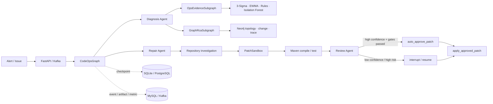

<div align="right">

[English](README-en.md) · [中文](README.md)

</div>

<div align="center">

# Ops AutoAgent Diagnosis

### 从告警到可验证自动修复的 LangGraph Agent

[](pyproject.toml)
[](https://langchain-ai.github.io/langgraph/)
[](src/ops_autoagent/api.py)
[](docs/eval-report.md)
[](LICENSE)

**收到告警后，先看证据，再定位代码、生成补丁、编译测试、独立审查；高置信且全部门禁通过时自动应用到受控工作区。**

</div>

---

## 它做什么

订单重复提交告警不应只得到一段“可能是幂等问题”的模型回答。这个项目把故障推进成可核验的修复闭环：

```text
告警
  → 指标 / 日志 / Trace / Runbook
  → 异常检测 + 图谱关联 RCA
  → 代码定位
  → PatchSandbox 生成补丁
  → Maven 编译与测试
  → 独立风险审查
  → 自动应用 / 低置信度人工确认
```

模型只能提出诊断和补丁，没有直接写仓库的工具。经过策略、摘要校验和审计保护的 `apply_approved_patch` 是唯一写入入口。

## 三个 Agent，各做一件事

| Agent | 输入与输出 | 副作用边界 |
| --- | --- | --- |
| **Diagnosis Agent** | 汇总 Metrics、Logs、Traces、Runbook、异常信号和 Neo4j 根因候选，输出故障假设与定位约束。 | 只读 |
| **Repair Agent** | 搜索代码和测试，在受控 PatchSandbox 中生成最小补丁和验证计划。 | 仅 PatchSandbox |
| **Review Agent** | 根据真实 Scope Guard、编译、测试、dry-run 和风险事实，输出结构化发布结论。 | 只读 |

`CodeOpsGraph` 是父图：统一管理阶段顺序、修复重试、Checkpoint、SSE 事件和写入权限。领域子图处理证据、图谱 RCA、仓库调查、补丁、验证和独立审查，但没有全局写权限。



## 已真实跑通的端到端 Case

**场景：订单重复提交导致重复写入。** 观测输入来自仓库内脱敏的 `TEST_SIMULATED_DATA` Fixture；模型、代码修改、Maven 验证和受控工作区应用是真实执行，Fixture 不会被伪装成线上结果。

| 阶段 | 本次执行结果 |
| --- | --- |
| 模型 | DeepSeek Flash（OpenAI-compatible API） |
| 故障定位 | `OrderSubmitService` 的“先检查、后标记”并发竞态 |
| 补丁 | 新增同步原子操作 `markProcessedIfAbsent`，调用方只执行该操作 |
| 修改范围 | `IdempotencyService.java`、`OrderSubmitService.java` |
| 验证 | Scope Guard、静态安全、Maven 编译、`IdempotencyServiceAtomicityTest` 均通过 |
| 审查与执行 | `ACCEPT_WITH_HUMAN_REVIEW`；策略确认高置信且全部门禁通过后自动应用 |
| 审计 | 17 次工具调用，约 313 秒；保存 Patch Digest、前后校验和、Effect Log |

完整过程见 [订单幂等 Case Study](docs/incident-case-study.md)。

## 5 分钟跑起来

### 离线 Demo：无需模型、无需基础设施

```powershell
python -m venv .venv
.venv/Scripts/python.exe -m pip install -e ".[dev]"
.venv/Scripts/python.exe -m ops_autoagent.demo
```

离线 Demo 只把模型输出替换成确定性适配器；父图、子图、PatchSandbox、Scope Guard、Maven 验证、Review 和 Checkpoint 都是生产实现。默认只交付补丁制品，不修改目标仓库。

### 全栈 Demo：真实模型 + Kafka + Neo4j + MySQL

```powershell
Copy-Item deploy/.env.full.example deploy/.env.full.local
# 在未跟踪的 deploy/.env.full.local 填入基础设施密码；不要提交 API Key。
docker compose --env-file deploy/.env.full.local -f deploy/docker-compose.full.yml up -d --build

$env:OPENAI_BASE_URL = "https://api.deepseek.com"
$env:OPENAI_MODEL = "deepseek-flash"
$env:OPENAI_API_KEY = "<your-api-key>"
Invoke-RestMethod -Method Post http://127.0.0.1:8099/api/v1/codeops/evaluation/run/incident-order-idempotency-race
```

完整命令、预期输出和边界说明见 [Demo 指南](docs/demo.md)。

## 为什么不是“调一下 LLM”的 Demo

| 能力 | 实现 | 价值 |
| --- | --- | --- |
| 可解释异常检测 | 3-Sigma、EWMA、规则和 Isolation Forest 先输出结构化信号。 | 减少普通波动被模型误判。 |
| 图谱关联 RCA | Neo4j 查询服务依赖、近期变更和 Trace 路径。 | 根因候选有拓扑和变更证据。 |
| 持久化编排 | LangGraph `StateGraph`、条件路由、子图、SQLite/PostgreSQL Checkpoint。 | 任务可中断、恢复、回放。 |
| 可靠事件链路 | 版本化 Event Contract、事务 Outbox、Kafka 幂等消费、DLQ。 | 不把 LangGraph 状态机误做成消息队列。 |
| 受控修复 | PatchSandbox、Scope Guard、Patch/Baseline Digest、唯一 Effect Boundary。 | 防止越界修改和审批后仓库漂移。 |
| 风险分流 | 高置信低风险自动应用到受控工作区；其余 `interrupt/resume`。 | 自动化仍有控制面。 |
| 可复盘评测 | 52 条业务 E2E Case + 16 条运行时安全/可靠性 Case，Trace/SSE 可回放。 | 失败能定位到具体阶段。 |

## 运行时架构：谁负责什么

~~~text
告警 / Webhook / Issue
        │
        ├── FastAPI：同步提交、SSE 回放、审批和评测接口
        └── Kafka：异步接入、削峰、重试和 DLQ
                         │
                         ▼
                   CodeOpsGraph（单任务控制面）
                         │
       ┌─────────────────┼──────────────────┐
       ▼                 ▼                  ▼
  LangGraph Checkpoint  MySQL 投影       Neo4j / Runbook
  当前节点、状态恢复    Task/Event/Outbox 拓扑、变更、依赖
                         │
                         ▼
              PatchSandbox → 验证 → 唯一写入边界
~~~

Kafka 不会替代 LangGraph：Kafka 负责把外部事件可靠送进系统；每一条
Incident-to-Fix 任务内部的状态、条件路由、重试、暂停和恢复仍由 CodeOpsGraph 管理。

### 父图与领域子图

~~~text
START
  → plan → orchestrate
      ├─ ops_diagnosis
      │    ├─ OpsEvidenceSubgraph
      │    └─ GraphRcaSubgraph
      ├─ agent_loop_investigation
      ├─ repo_understanding / engineering_knowledge_rag
      ├─ RepairProposalSubgraph
      ├─ VerificationSubgraph
      └─ IndependentReviewSubgraph
  → finish
      ├─ retry_repair → repair_feedback → RepairProposalSubgraph
      ├─ auto_approve_patch → apply_approved_patch
      ├─ human_approval → interrupt / resume
      └─ summarize → END
~~~

| 子图 | 内部阶段 | 产物 | 是否可写 |
| --- | --- | --- | --- |
| OpsEvidenceSubgraph | prepare → collect → publish | 证据包、负证据、异常信号 | 否 |
| GraphRcaSubgraph | prepare → correlate → publish | 拓扑路径、变更关联、根因候选 | 否 |
| RepositoryInvestigationSubgraph | prepare → readonly investigation → publish | 代码片段、调用关系、测试与约束 | 否 |
| RepairProposalSubgraph | prepare → sandbox proposal → publish | Patch Proposal、Digest、验证计划 | 仅沙箱 |
| VerificationSubgraph | prepare → run verification → publish | 编译、测试、超时和日志摘要 | 否 |
| IndependentReviewSubgraph | prepare → review facts → publish | 发布结论、风险、重试约束 | 否 |

### LangGraph 能力落地

| 能力 | 代码中的作用 |
| --- | --- |
| Typed State | CodeOpsState、OpsState 和 Pydantic 契约让 Node 传递结构化事实，而不是不透明聊天文本。 |
| Conditional Edge | orchestrate、finish、审批与应用路由，把下一步显式变成可测试的策略。 |
| Reducer | events、tool trace、effect log 采用追加 reducer，重试和并行不会覆盖历史。 |
| Fan-out / Fan-in | Metrics、Logs、Traces 并发采集，在 Evidence Barrier 确定性汇合。 |
| Checkpoint | Memory、SQLite、PostgreSQL 保存当前节点、恢复状态、补丁摘要与修复上下文。 |
| Streaming | astream updates 与 FastAPI SSE 实时输出 Node、子图、测试和 Effect。 |
| Bounded loop | repair feedback 与 attempt/tool/retry budget 允许改进但不会无限循环。 |

## 生产控制面

### 异常检测先于 LLM

OpsEvidenceSubgraph 先将原始遥测转成可解释信号，再交给 Diagnosis Agent：

| 检测器 | 擅长发现 | 输出 |
| --- | --- | --- |
| 3-Sigma | 突发尖峰、明显偏离基线 | z-score、基线、严重度 |
| EWMA | 持续趋势、缓慢劣化 | 平滑趋势、偏离方向 |
| 规则 | 错误码、超时、日志模式 | 明确命中的证据和阈值 |
| Isolation Forest | 多指标组合异常 | 多维异常分数与特征摘要 |

成功查询但没有发现异常会作为负证据保留，模型不能把它改写成“数据缺失”。

### Neo4j 图谱关联 RCA

~~~text
api-gateway → order-service → payment-service → mysql-primary
                         └→ inventory-service → redis
~~~

Neo4j 保存服务、依赖、数据库、Topic、变更和 Runbook 的受控快照。GraphRcaSubgraph 将
拓扑、近期变更、调用链和异常信号组合为带路径和来源的根因候选；图不可用时会明确标记
NOT_CONFIGURED 或 UNAVAILABLE，不会编造拓扑。

### Kafka、Outbox 与 DLQ

~~~text
Alert webhook
  → MySQL: Alert + Dispatch + Outbox（同一事务）
  → Kafka: aiops.alerts.v1 / aiops.events.v1
  → idempotent consumer
  → CodeOpsGraph
  → failure → aiops.dlq.v1
~~~

- Outbox 只有收到 Kafka 成功确认后才迁移为 PUBLISHED。
- 每个事件包含版本和 idempotencyKey，重复投递不会重复启动修复。
- 无法解析或超过预算的消息带原始 envelope 与错误分类进入 DLQ。

## 安全模型

```text
LLM proposal
  → Pydantic contract validation
  → Scope Guard + PatchSandbox
  → compile / test + independent review
  → policy decision
  → apply_approved_patch (the only write boundary)
```

- 默认 `CODEOPS_APPLY_MODE=delivery_only`，只交付补丁制品。
- 全栈受控演示可开启 `apply_to_worktree`；它只允许写入显式声明的工作区，**不是生产仓库授权**。
- 自动应用必须同时满足：策略启用、`INCIDENT_TO_FIX`、高置信、低/中风险、低爆炸半径、Scope Guard、PatchSandbox、编译和测试全部通过。
- 其余情况进入 `interrupt()`，以同一 `thread_id` 用 `Command(resume=...)` 恢复。
- Trace、SSE、事件和评测投影会脱敏、截断；密钥不进入源码、Fixture、日志或提交记录。

### 风险分流

| 条件 | 处理结果 |
| --- | --- |
| 高置信、低/中风险、低爆炸半径，且全部验证门禁通过 | 自动批准并应用到显式允许的受控工作区。 |
| 置信度不足、风险高、测试不充分、Scope Guard 拒绝或策略关闭 | 不写目标仓库；交付补丁或通过 interrupt() 等待人工决定。 |
| Patch Digest / Baseline Digest 不匹配 | 拒绝应用，避免审批与实际仓库状态脱节。 |
| 目标路径越界或未授权 | Scope Guard 拒绝，记录安全事件。 |

Runbook 动作使用 Kubernetes server-side dry-run；它会请求 API Server 校验 Admission、
Policy 和 Schema，但不会修改集群。

## API、SSE 与可观测性

| 能力 | Endpoint |
| --- | --- |
| 服务健康检查 | GET /actuator/health |
| OpenAPI | GET /docs |
| CodeOps 任务提交 | POST /api/v1/codeops/task/submit |
| 任务事件与 SSE 回放 | GET /api/v1/codeops/task/{task_id}/events |
| 任务观测投影 | GET /api/v1/codeops/task/{task_id}/observability |
| 业务 Case Catalog | GET /api/v1/codeops/evaluation/cases |
| 运行时安全 Case | GET /api/v1/codeops/evaluation/runtime/cases |
| Prometheus 指标 | GET /actuator/prometheus |

SSE 只输出有界摘要、节点/子图身份、尝试次数、Artifact 引用和回放元数据；完整 Prompt、
密钥和不受限制的工具响应不会出现在事件流中。

MySQL 投影保存 Task、Event、Artifact、Runtime Metric、Outbox 与 Effect Log；
Prometheus 记录子图耗时、LLM 调用、审批等待、SSE 回放、Scope Guard 拒绝、修复轮次和
未授权写入次数。

## 评测与文档

| 想了解什么 | 从这里开始 |
| --- | --- |
| 立即运行一个 Case | [Demo 指南](docs/demo.md) |
| 看订单幂等修复全过程 | [Case Study](docs/incident-case-study.md) |
| 看生产拓扑与验证顺序 | [生产架构与验证](docs/production-architecture.md) |
| 学 LangGraph 在项目里如何落地 | [LangGraph 迁移说明](docs/langgraph-migration.md) |
| 查 52 + 16 条 Case 的统计边界 | [Eval 说明](docs/eval-report.md) |

```powershell
.venv/Scripts/python.exe -m pytest -q
.venv/Scripts/python.exe -m compileall src
git diff --check
```

## 项目结构

~~~text
src/ops_autoagent/
├── graphs/       # CodeOps 父图、子图、状态、路由和 Checkpoint 协作
├── codeops/      # 仓库工具、PatchSandbox、验证、策略和 Eval
├── ops/          # Metrics / Logs / Traces / Runbook 与异常检测
├── topology.py   # Neo4j 拓扑查询与图谱 RCA
├── eventing.py   # Kafka Event Contract、Consumer、DLQ
├── outbox.py     # MySQL Transactional Outbox
├── api.py        # FastAPI、SSE、审批与评测接口
└── persistence.py# SQLite / PostgreSQL Checkpoint 后端
~~~

完整的部署步骤、拓扑快照契约和安全验证顺序在 [生产架构与验证](docs/production-architecture.md)。

如果这个项目对你有帮助，欢迎点个 ⭐。
